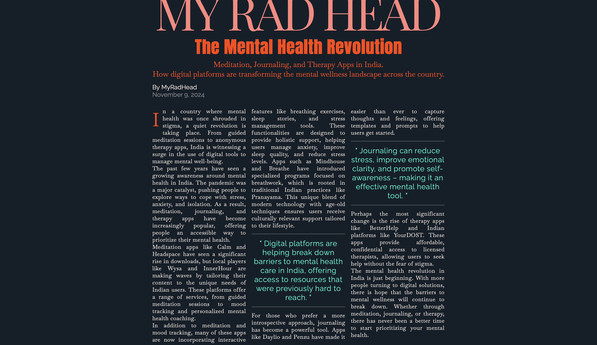

🌿 The Mental Health Revolution: Meditation, Journaling, and Therapy Apps in India

📖 About the Project

In this project, we explore the rise of mental health apps in India and how they are revolutionizing the wellness landscape. The magazine-style webpage covers the emergence of digital platforms like meditation, journaling, and therapy apps that are transforming the way people approach mental well-being in the country.

🛠️ Built With

HTML5: For the structure of the webpage.
CSS3: For styling, layout, and responsiveness.
Google Fonts: For custom typography.
Font Awesome: For social media icons.

💡 Features

A magazine-style layout showcasing an in-depth article on mental health apps in India.
Sections covering the benefits of meditation, journaling, and therapy apps.
Interactive timeline highlighting the evolution of mental health technology in India.
Image gallery featuring popular mental wellness apps.
Responsive design for various screen sizes.
Interactive app logo buttons that redirect you to relevant website or app store when clicked on.

🖼️ Screenshots

🚀 Getting Started

To run this project locally, follow these steps:

Prerequisites
Make sure you have the following installed:

A modern web browser (e.g., Chrome, Firefox)
A code editor (e.g., VS Code)

1. Installation
   - Clone the repository:
     git clone https://github.com/docmischa990/MRH-issue-1.git

2. Navigate to the project directory:
   - cd MRH-issue-1

3. Open the project in your browser:
   - Open index.html in your browser to view the website.
  

📁 Folder Structure
   mental-health-revolution/
   ├── images/
   │   ├── Logo/
   │   ├── img/
   │   ├── MH-Brand-Logos/
   ├── styles.css
   ├── index.html
   └── README.md

📄 License

This project is licensed under the MIT License - see the LICENSE file for details.

📧 Contact

Mischa Doctor - GitHub Profile
docmischa990 - GitHub username

